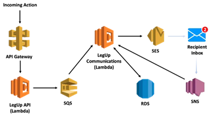
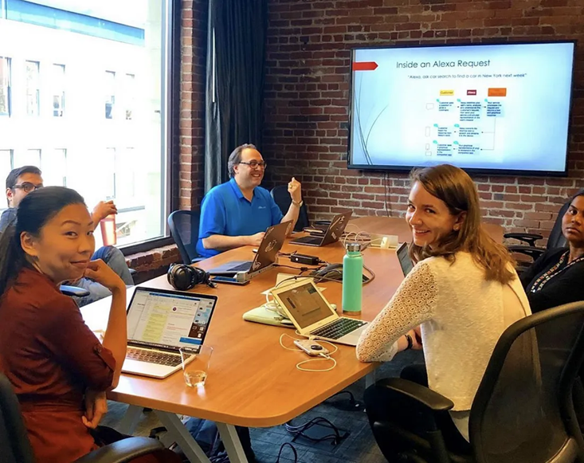

# Garrett's Blog

### Fractional CTO | Engineering Leadership | Technology Product & Vision | Full Stack Development | Franchise Owner | Team Building & Development

***

  

[How AI Supercharges a Fractional CTO to Deliver like a Full Dev Team](./how-ai-supercharges-a-fractional-cto-to-deliver-like-a-full-dev-team)

How I've been able to use different AI coding tools to supercharge my fractional CTO skills

**May 29, 2025**

***

  

[Reflections on the future of introductory CS classes](./reflections-on-the-future-of-introductory-cs-classes)

My thoughts after being a section leader for Stanford's introductory Code in Place program and investigating different AI coding tools

**May 23, 2025**

***

  

[How do GitHub Copilot and Cursor compare as web scrapers?](./how-do-github-copilot-and-cursor-compare-as-web-scrapers)

Taking two popular code generation tools for a spin

**April 24, 2025**

***

  

[How a Tech Leader Ventured Into a Franchise Ownership](./how-a-tech-leader-ventured-into-a-franchise-ownership)

How I went about opening a skincare franchsie as a tech leader

**April 1, 2025**

***

  

[How Being a Startup Cofounder helped my Big Tech Transition](./how-being-a-startup-cofounder-helped-my-big-tech-transition)

Leadership lessons learned on my journey from a startup to a large tech organization

**May 1, 2023**

***

  

[Why Your Startup Should Invest in a Strong Technical Foundation](./why-your-startup-should-invest-in-a-strong-technical-foundation)

Make your pivots easier by taking some design time upfront

**Feb 15, 2022**

***

  

[Advice from a Developer, Industry Executive, and Startup CTO](./advice-from-a-developer-industry-executive-and-startup-cto.md)

Summary from an Ask Me Anything session from a section leader in Stanford’s Code In Place program

**July 16, 2020**

***

  

[What you need to know to build a serverless communication system](./what-you-need-to-know-to-build-a-serverless-communication-system)

How our startup designed an event-driven architecture to automate e-mails in a cost effective way

**June 9, 2020**

***

  

[Lessons Learned from my Transition to Startup CTO](./lessons-learned-from-my-transition-to-startup-cto)

My story of venturing out from a Corporate VP role

**Jan 23, 2020**

***

  

[Teach What you Know to Learn it Better](./teach-what-you-know-to-learn-it-better)

What I learned by leading an Alexa-development workshop

**Dec 4, 2019**

***

  

[Top 5 benefits of the Jargon SDK for Voice Content Management](./top-5-benefits-of-the-jargon-sdk-for-voice-content-management)

Top reasons to adopt the Jargon SDK for your voice applications

**Jan 28, 2019**

***
