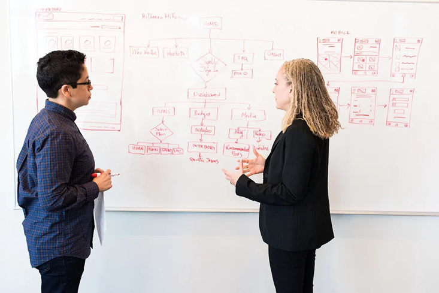

# Lessons Learned from my Transition to Startup CTO

### My story of venturing out from a Corporate VP role

###### *January 23, 2020*

  

I joined LegUp as a cofounder and CTO and recently left my role as a VP of Technology at Expedia to focus full-time on my startup. LegUp is using technology to help working parents and their families find trusted childcare. It’s early days and an exciting road ahead of us, but I wanted to take some time to reflect on my journey and hopefully give some insights to others considering similar moves.While we’ve only just started LegUp, I’ve been exploring joining an early stage startup for the past year and a half.

Every career journey is unique, and that’s even more true when making the move between the corporate and startup worlds. There isn’t much written about the mechanics of finding a co-founder or joining a startup in a situation like mine — a senior person looking to join with someone in the early days. I hope the story of my journey helps others consider similar moves.

#### Know what’s important to you

As with any career decision, you should ask yourself ***why*** you want to make this move — in my case a move to an early stage startup. When I started looking for a new role, I was looking for something to reignite my passion. I started in my comfort zone — larger companies in the area that matched my experience like Amazon, Google, and Microsoft. As I explored, I realized I wanted something that would let me stay close to my technical roots while providing strategic direction.

In parallel, I was getting more involved as an advisor for a local startup founded by an ex-coworker. As I watched my coworker, I realized the diversity of experiences in a startup could give me the strategic and technical mix I was looking for. I also realized that startup life was different. The pace was different, filled with uncertainty and no clear career path. It involved making several tradeoffs — financially, mentally, and emotionally — with no guarantees of success. As a co-founder, the life or death of the company rests on your every decision. The odds are against you.

> This led me to realize that these risks were the draws I was looking for … to let me live more.

I had the benefit of being close to this startup and being able to do some light work with them. This combined with much reflection led me to realize that these risks were the draws I was looking for … to let me *live more*. I felt I was playing it safe and wasn’t growing and challenging myself. I was ready to explore the excitement of uncertainty by trading off the status quo. I wanted the thrill of change and an environment where what I did mattered. I wanted to grow and guide a company beyond the technical vision. I also knew based on my own personality that I would thrive with a partner in place to work with and help with my transition.

  

Yes, this thrill came with financial uncertainty. Anyone considering this move needs to look at their finances, understand their personal runway and comfort going months or years without pay, and review with their loved ones. I was fortunate that a long history in large software companies had given me a comfortable personal runway.

#### Explore your side interests

I had been introduced to the world of angel investing several years ago. This gave me an opportunity to interact with several different startups. While I wasn’t thinking of starting a company myself initially, I found that I enjoyed seeing and getting to know a bit more about how startups work. Granted this was only one view (and, frankly, a slightly distorted one seeing startups from the angle of an investor), but it was insightful nonetheless.

Over the years, and without even realizing it, I had built up an entirely new network outside of my full-time corporate job. As I was exploring new career possibilities, this exposure helped me look at opportunities with an eye towards whether they were investible.

In general, when thinking about a career looking at some of your side activities can be a source of inspiration.

#### Get some coaching

Beyond the financial uncertainty, don’t forget to consider the emotional upheaval of this move! I’d heard about the emotional roller coasters that startup founders endured as I started networking more in the community. I saw this first-hand as I got more involved as an advisor. The compressed timelines of validating and delivering ideas is not for the faint of heart.

> Having an independent sounding board helped me find my strengths. Everyone’s needs are different, and having a coach to help put together your own plan helps.

I’ve been working with a professional career coach for the past few years. Having an independent sounding board helped me find my strengths and guided my previous career moves. Everyone’s needs are different, and having a coach to help put together your own plan helps. Whether it’s helping put structure around your plans, or helping you reflect and adjust along the way, I highly recommend having a professional at your side.

If you still think this move is for you, it’s important to take time for yourself. For me, I discovered that walks through the park and quiet time to reflect during this light physical activity helped me navigate this rugged terrain.

#### Establish a framework to evaluate opportunities

  

Once I focused my search on early stage startups, I tapped my network and got introductions to over a dozen founders and venture capitalists. There are no set processes to this type job search — some were further along the way and needed someone to take the product to the next level, others had little more than an idea and a need for a co-founder. As I prepared to start meeting with people, I decided to codify what was important to me into a framework.

> Having a framework guided me as I went deeper with a company. I boiled it down to “the three P’s” — Personal Relationship, Potential, and Passion

Everyone’s criteria will be different, but having a framework guided me as I went deeper with a company. In my case I boiled it down to what I dubbed “the three P’s”:

* **Personal Relationship**: This was about them, the founder(s). The thrill I was looking for was the ability to learn more, move fast, and tackle a different challenge every day. This meant a lot of wild emotional swings, changes in direction, and a stick-to-it approach. The chemistry, working style, and life attitude was critical to help get through these periods. Some questions I asked people included “Why did they start this company and what motivates them?” “What do they want in a cofounder?” and “How would we collaborate on a new idea or fundraising decision?”
* **Potential**: A big part of my motivation was an ability to make a difference and have impact. Partly this meant an ability to make positive change in the world. Partly it meant impact in terms of personal financial well-being. While I went into this with the mindset that it was more likely than not I’d walk away with nothing, I had to feel there was potential for a life-changing payout. I had to believe the team could see it through, and that I would have the right role and ownership in the company. I had to be convinced that I would invest my own money into this — in a real sense, I would be!
* **Passion**: This was about me — how much passion and enthusiasm I had about the space. Of course, dedicating myself to an idea that I’d be owning for the next few years meant I had to have a passion around the space the startup was in. Every startup I had followed had a pivot at some point. I knew this wasn’t about the specific idea, but rather whether I could see myself working in a given space for the next several years.

#### Embrace the ups and downs

A lot of us only see the tail end of the startup journey — the big public fundraising rounds or the exits (successful or otherwise). The truth is there is a large “messy middle” where every day can be different, and you don’t know how things will play out.

I had heard this story from those I knew in the startup community. But I hadn’t internalized it until I started my search. Over the course of a month, I met with 15 different founders. About a third of them were interesting enough that I had more more than one discussion. My attitude and outlook changed from one day to the next. One company would look interesting but then I’d see fundamental value differences in follow-up meetings. Another would decide to go with a different person. And unlike “big corporate” job hunts, I’d see several of these changes happen in the course of a few days.

The search itself provided me with some insight into this fast pace and roller coaster of emotions. And even though some of these setbacks hurt, I kept at it and kept coming back. The search itself gave me confidence that I’d have the resolve to deal with the challenges and setbacks once I joined a startup.

#### Take time with the team

  

> I spent a few hours on some small projects with potential partners. This helped me understand our working styles, and where actions differed from words.

Startups don’t have established red tape to bring on part-time help. It was easy to coordinate spending a few hours on some small projects with potential partners. This helped me understand our working styles, and let me see where their actions differed from their words.

In one case, I started looking into some technologies we could use to design and build a solution. As part of this, I also started exploring and sharing different business models we could pursue. These could influence the technical design and I felt was good exploration as the market fit hadn’t yet been established. It became evident though that the co-founder wasn’t interested in my thoughts outside of the technical vision. With a minimal amount of time invested on my part, it became clear that we didn’t have the same expectations.

As an aside, this was one of the great draws that brought my co-founder and I together. It was clear from working with her that she valued an equal thought partner. She wanted someone who would challenge her on business and product direction. And I encourage her to challenge me about the analysis and benefits of my decisions on our technical stack.

#### Follow your feelings
As a co-founder or early stage employee, you’re going to be putting in a lot of time with your fellow founder(s). Having a framework and spending time with the team as I’ve outlined helps. But it’s also important to do a gut check and see how you *feel* working for a startup and with your potential partners.

One of the opportunities I pursued was with someone I had enjoyed working with in the past. We were excited about the area the company was tackling and both of us wanted to explore working together again. But as we took some time and started to work together again, I realized the startup environment was different. Personality traits that previously were minor quirks were amplified to major irritations when we were working in small, close quarters. On multiple occasions I felt belittled and ignored, and I realized how different our relationship would be in this environment. While things looked good on paper, the experience left me feeling sad and frustrated. Despite the good personal connection, I followed my feelings to explore different options.

#### Evaluate from the head

  

Because I was looking at early companies, there were a lot of unknowns and a lot of risk. It was just as easy to fall in love with an opportunity as it was to find holes. Working with the team and monitoring my feelings helped, but it still left me with doubts about the move.

I decided to follow a technique that one of my previous managers uses in helping guide difficult decisions which he calls “what do you have to believe.” You make a list of statements that you would need to believe in order for you to say “yes” to a decision. Then you find ways to prove or disprove them. I did that to help me narrow a few opportunities, reminding myself that “none of the above” was also a valid choice. For each statement, I then thought about ways that I could test them to believe. For example, in one case, one of my statements was “We can find a secret sauce to differentiate the business.” I decided to do a brainstorming session to list different ideas and understand how we would test them. This allowed me to see whether there was a rich list of items and opportunities, or whether we were stuck before I started.

#### Take a leap of faith

When all is said and done, you can over-analyze an opportunity to death. Despite the fast pace of a startup environment, I was grateful that everyone I talked with gave me time to explore. After all, they were taking a big step bringing on a co-founder and needed to run through their own evaluation with me!

> If you find you’re compatible with your co-founder(s), and find in your heart and in your head that this opportunity will give you what you’re looking for, take that leap of faith and pull the trigger.

You may never be 100% sure that this is the right move for you. But if you find that you are compatible with your co-founder(s), if you’ve worked with them and find in your heart and in your head that this opportunity will give you what you’re looking for, if you’ve done the financial analysis and have the support of your loved ones, then by all means take that leap of faith and pull the trigger.

My LegUp journey is still unfolding. I don’t know if we’ll make it or how things will work moving forward. But I am enjoying the ride with my co-founder and others involved. Onwards and upwards!‍

  

***

#### Leave a comment

###### Comments are powered by Utterances. A free GitHub account is required. Please be respectful. No swearing or inflammatory language. No spam.
###### **I reserve the right to delete any inappropriate comments.**

