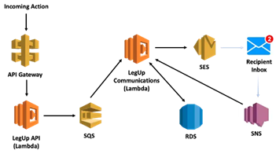

# What you need to know to build a serverless communication system

### How our startup designed an event-driven architecture to automate e-mails in a cost effective way

###### *June 9, 2020*

As part of our product, [LegUp](https://www.legup.care) communicates with families and day care providers. Automating this workflow is an important part of our ability to scale. As a scrappy startup, we wanted a solution that allows us to build something scalable at an affordable price. We decided to use AWS’s Simple Email Service (SES) to help manage our e-mails. To provide scalability and avoid throttling when sending bulk e-mails, we built an event-driven system. This system integrates with Simple Queue Service (SQS) and Simple Notification Service (SNS). It is managed through a Lambda function.

> If you’ve tried using SQS or other event-bases systems, you’ve likely encountered the problem of idempotency. The same message can be delivered multiple times.

If you’ve tried using SQS or other event-bases systems, you’ve likely encountered the problem of idempotency. The same message can be delivered multiple times. Additionally SNS can return details of message receipt before SES returns. This gives you a lot to manage to ensure that you send outgoing mails once and only once! In this blog post, I’ll explain howLegUp set this up to deal with these issues and provide some Typescript code snippets.

### Architecture

<p align="center">
  
</p>

Our architecture consists of several AWS components:

* **API Gateway** exposes an endpoint for incoming calls
* API Gateway in turn calls a **Lambda** function which hosts the LegUp API
* If the call needs to send e-mails this function asynchronously puts messages onto an **SQS Queue**
* This triggers another Lambda function, LegUp Communications System, which pulls these messages
* This Lambda function processes the event and sends a request to **SES** to send an e-mail message. It records information about this message in an **RDS** database
* After the recipient receives a message, a notification is sent to **SNS**
* SNS triggers the LegUp Communications System which writes a result into the database

Let’s talk through how these components interact as we walkthrough the flow of sending out e-mails.

### Initial API request

When our primary API receives a request, it may result in a need to send hundreds or even thousands of e-mails. We don’t want to block while it sends out mails. Even if we did try to send mail from this primary worker, SES limits the number of e-mails we can send per second. Instead we hand this task off to another process, spacing these requests to avoid throttling. To set this up, we post messages with the content of our mail into SQS. We take the contents of the mail (recipient, subject, and message) and save these as the `MessageBody`. Because we manage different types of communications, we add metadata to specify this as a plain-text e-mail message.We do this using custom MessageAttributes, channel and type as shown in this code snippet.

```
export async function sendEmail(to: string, subject: string, message: string): Promise<boolean>{
  try {
    const msg = {
      MessageBody: JSON.stringify({to, subject, message}),
      DelaySeconds: ((delay++) % 900),
      MessageAttributes: {
        channel: {
          DataType: “String”,
          StringValue: “email”
        },
        type: {
          DataType: “String”,
          StringValue: “plaintext”
        }
      },
      QueueUrl: process.env.emailQueueUrl,
    };
    const data = awaitSQS.sendMessage(msg).promise();
    success = !!data;
  } catch (e) {
    success = false;
  }
  return success;
}
```

Note the use of the global `delay` variable passed in to `DelaySeconds`. This allows us to queue a large number of messages and delay sending them to avoid per-second limits.

### Queue Set Up

Setting up the queue is simple and can be done in the AWS Management Console.

* Select **Simple Queue Service** from within the AWS Management Console
* Click **Create New Queue** to create a new queue
* You’ll want to keep the default options -selecting a **Standard Queue**. This queue type is a little cheaper (40cents per million requests). More importantly it allows for greater throughput
* Click **Quick-Create Queue** to create your queue

Once you’ve created the queue you’ll need to create a Lambda function to processes messages. Start by creating an empty Lambda function to get its ARN. Once you’ve done that, you can add a trigger for the Lambda function by following these steps:

* Select **Add trigger** to create a new trigger
* In the **Select a trigger** dropdown, choose SQS
* You’ll then choose the queue that you want to use as a trigger — select the one you created in SQS
* You can set the **batch size** to limit the number of messages you will receive in your Lambda function. You can set this to 1 to process one message at a time. Or you can set it to a higher number if you want to handle multiple messages in your Lambda function at once

### LegUp Communications System

<p align="center">
  
</p>

As noted, we set up our Queue as a standard queue which provides at-least-once message delivery. It is possible that our Lambda function will receive the same SQS message more than once. We don’t want e-mail recipients to receive duplicate messages. We need some level of idempotency within our handling code. To achieve this, we use a table within a Postgres database which allows us to look up details of this message. This table of sent messages will also come in handy when we process the recipient’s delivery notification.

> This atomic operation lets us either add a new entry into our database or update it if it already exists.

The table definition is as follows:

```
CREATE TABLE IF NOT EXISTS messages(
  email_id bigserial UNIQUE, — email ID
  message_id VARCHAR(128), — ID of the message, returned from SES
  recipient VARCHAR(128), — e-mail address sent to
  sent_time timestamptz, — sent timestamp from mail
  delivered_time timestamptz, — delivery timestamp from recipient (if delivered properly)
  delivered boolean, — set to true if the message was delivered
  msg_queue_id VARCHAR(128) UNIQUE, — Message Queue ID of add (to check for duplicates)
  updated boolean, — Auxiliary column indicating whether an entry was added or updated
  created_at timestamptz DEFAULT now() NOT NULL
);
```

The `msg_queue_id` and `updated` fields help us achieve idempotency when handling SQS messages.

When we see a new message, the first thing we do is attempt to add an entry into our DB using the new queue ID. We use an upsert to achieve this. This atomic operation lets us either add a new entry into our database or update it if it already exists. Here is the SQL statement to achieve this:

```
INSERT INTO messages(message_id, recipient, msg_queue_id, updated) VALUES ($1, $2, $3, false) ON CONFLICT (msg_queue_id) DO UPDATE SET message_id = EXCLUDED.message_id, recipient = EXCLUDED.recipient, updated = true RETURNING updated, email_id;
```

The `updated` field indicates whether we created a new entry or updated an existing one. If it was an update, we should stop processing this message. Otherwise we’ll post a new message to SES. After we call SES, we’ll get a message_id and can call the same SQL query as above to set this messageID.

### SNS integration and notifications

After we’ve sent an e-mail out, we’re interested in knowing if it was delivered or bounced. We use SNS to receive a notification after the recipient’s mail server has processed our message. We reuse the LegUpCommunications System to process this receipt. To do this, we need to make three sets of changes:

1. First, we need to create the notification topic in SNS.

* From the AWS Management Console, find **SimpleNotification Service**
* Click Topics, then **Create topic**
* Enter the name of the topic. You can keep default values for the other options and click Create topic

2. Second, we need to set our Lambda function as a subscriber to this topic

* Click on the topic that you just created and click **Create subscription**
* Under protocol select **AWS Lambda**
* Enter the ARN of the lambda function that you want to receive notifications. We used the same Lambda function to process SQSand SNS notifications, but you can select a different Lambda function

3. Third, we need to configure SES to trigger these notifications

* From the AWS Management Console, find **SimpleEmail Service**
* Under **Email Addresses**, create a new entry for the e-mail address you will be sending from. This may require a verification step
* Select the e-mail address, and expand the **Notifications** section
* Click **Edit Configuration** to enable your notification settings. Here you indicate that you would like SNS to process deliveries, bounces, and complaints. Select the SNS topic you set up in the first step
* Check the **Include original headers** checkbox. You’ll need these headers to associate the SNS message with the sent e-mail as described below.

Our notification includes the message ID (the return result from the call to SES), along with delivery details. But order is not guaranteed. It’s possible to receive an SNS notification before the call to SES has returned. This makes it difficult to match based on this message ID!

To solve for this, we can use the email_id that was set in the database during the call to enforce idempotency. We made this call before the call to SES, so we know that we’ll have this value in the callback notification. But to get this, we need to set a custom e-mail header with this value. We named ours “X-Corrleation-ID.” To send a custom header, you’ll need to use the sendRawEmail function rather than the simpler sendEmail call. But it’s not too hard to set up as you can see from the following code snippet:

```
export async function sendEmail(email_id: string, from:string, to: string, subject: string, message: string): Promise<string | null> {
  const mailMessage = `From: ‘LegUp’<${from}>\nTo: ${to}\nX-Correlation-ID: ${email_id}\nSubject:${subject}\nContent-Type: text/plain; charset=”us-ascii”\nMIME-Version: 1.0\n\n${message}`;
  let messageId: string | null = null;
  try {
    const data = await new AWS.SES({apiVersion: “2010–12–01”}).sendRawEmail({
      RawMessage: { Data:Buffer.from(mailMessage)},
    }).promise();
    messageId = data.MessageId;
  } catch (e) {
    messageId = null;
  }
  return messageId;
}
```

Now, within the callback that handles the SNS notification, we look for this header and use that to correlate with the message that is saved in our database

```
// We need a message ID else we can’t do anything
if (!event || !event.mail ||!event.mail.messageId || !event.mail.headers) {
  return false;
}
// The headers are given as an array of name/value JSON objects — find the one with the correlation ID. This ID can be used to retrieve details or set information in the messages table in our database
const email_id: string | undefined = (event.mail.headers.find((h: {name: string, value: string}) => h.name ===”X-Correlation-ID”) || {}).value;
if (!email_id) {
  return false;
}
const sent_time = event.mail.timestamp;
let status: “delivered” |”bounced” | “complaint”;
if (event.notificationType ===”Delivery”) {
  status = “delivered”;
} else if (event.notificationType ===”Bounce”) {
  // Note you can also look at the event.bounce structure for more details about this bounce
  status = “bounced”;
} else if (event.notificationType ===”Complaint”) {
  // Note you can look at the event.complaint structure for more details about the complaint
  status = “complaint”;
}
```

### Summary

There are several moving pieces to building a scalable automated e-mail system with AWS technologies. Idempotency, ensuring duplicate mails aren’t sent, and managing recipient mail server responses are possible with the use of some technologies beyond SES. I hope this guide gives you an idea on one way you can achieve this.

Have you built e-mail automation systems and have something you’d like to share? Please leave your comments and let me know about your experiences — I’m always looking to grow my knowledge!‍

***

#### Leave a comment

###### Comments are powered by Utterances. A free GitHub account is required. Please be respectful. No swearing or inflammatory language. No spam.
###### **I reserve the right to delete any inappropriate comments.**

<script src="https://utteranc.es/client.js"
        repo="gsdriver/gsdriver.github.io"
        issue-term="pathname"
        theme="github-light"
        crossorigin="anonymous"
        async>
</script>
